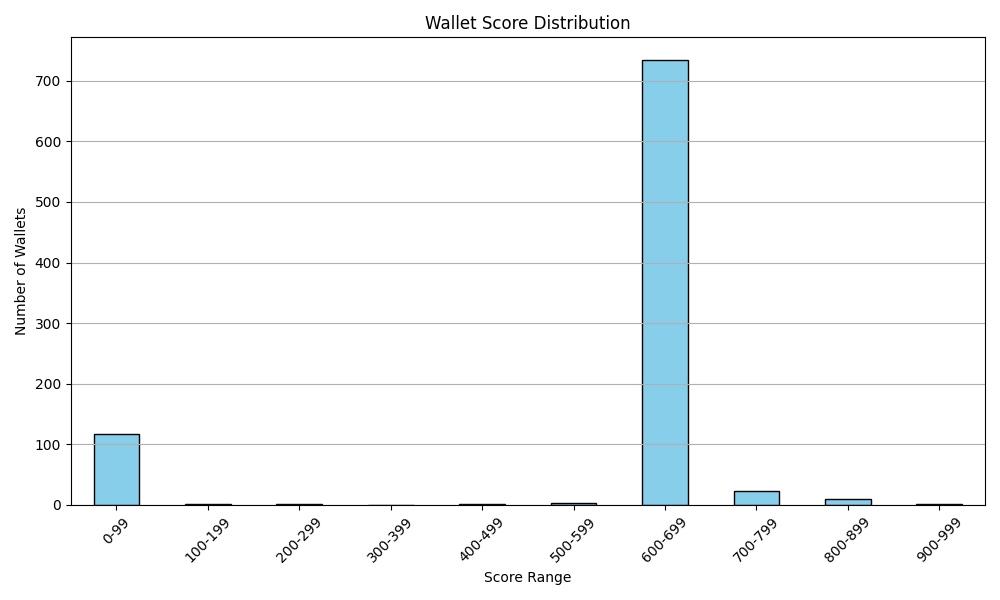

# Wallet Credit Score Analysis

After scoring all wallets based on their transaction behavior using the Aave V2 dataset, this file summarizes the analysis of wallet scores, their distribution, and behavioral characteristics across score buckets.

---

## 📊 Score Distribution

Wallet scores were bucketed into the following ranges:
- 0–100
- 100–200
- 200–300
- 300–400
- 400–500
- 500–600
- 600–700
- 700–800
- 800–900
- 900–1000

The figure below shows the number of wallets in each bucket.

---

## Wallet Behavior Analysis

###  Wallets with Low Scores (0–200):
- Frequently perform risky operations such as borrowing without sufficient collateral.
- Often experience liquidation calls due to over-leveraged positions.
- Have inconsistent repayment behavior, indicating poor financial responsibility.
- Are classified under "High Risk" and "Very High Risk" in the scoring.

### 🔺 Wallets with High Scores (800–1000):
- Show consistent and safe usage patterns such as regular deposits and repayments.
- Rarely or never face liquidation, and often maintain healthy collateralization.
- Demonstrate low-risk behavior, earning "Low Risk" or "Very Low Risk" tags.
- Are typically well-aligned with the protocol’s best practices.

---

## 📌 Conclusion

- The score model successfully differentiates between high-risk and low-risk wallets.
- Most wallets are concentrated in the 500–700 range, with a small portion achieving very high or very low scores.
- This analysis can support protocol design decisions, such as flagging risky borrowers, adjusting interest rates, or offering incentives to high-performing wallets.

